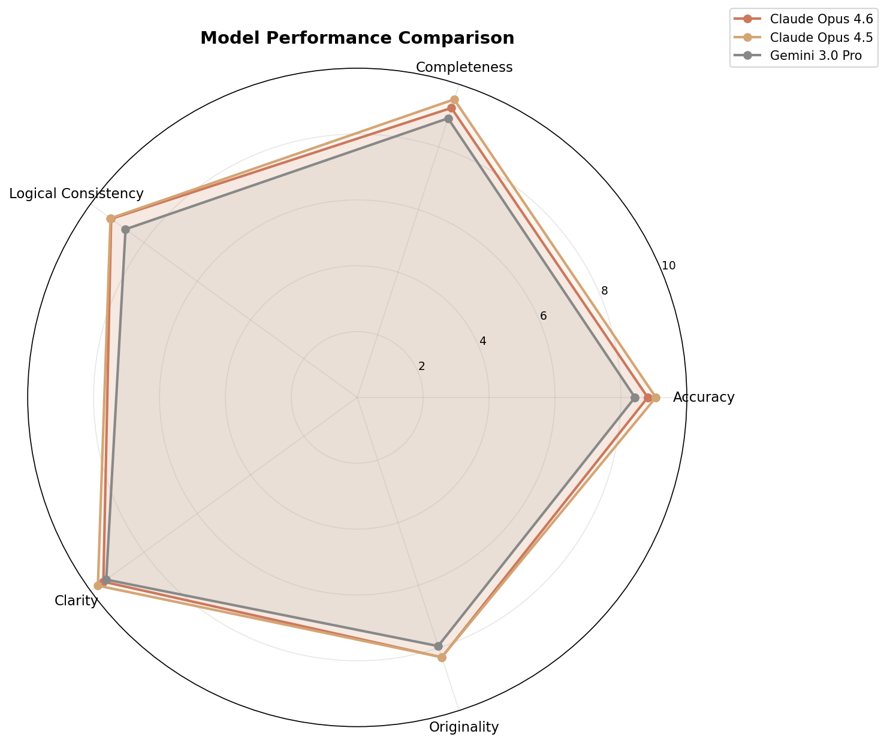
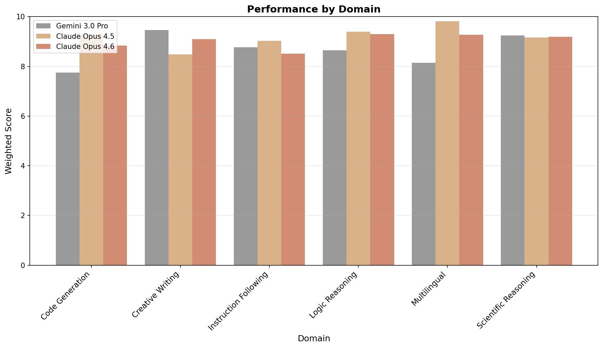
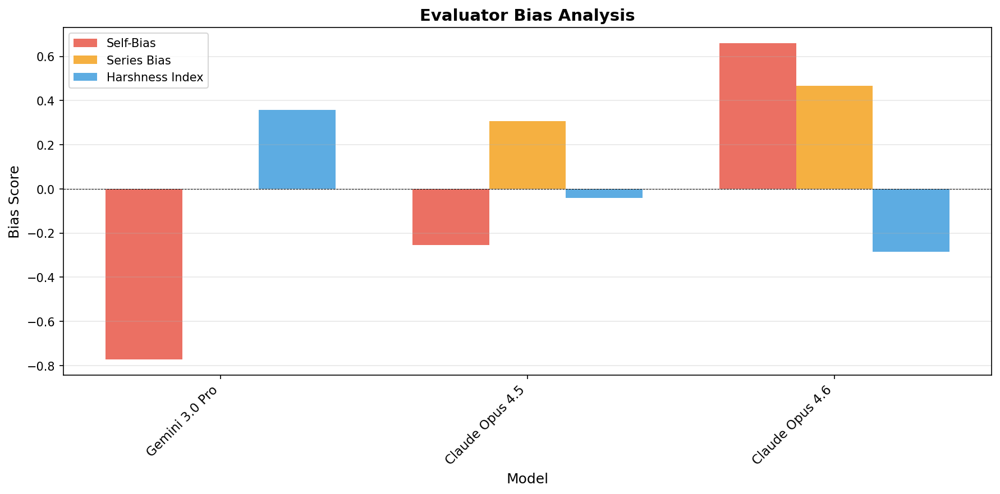

# LLM 相互評価・メタ評価フレームワーク

> **AIモデルは互いを客観的に評価できるのか？**
> 複数のLLMが互いの回答を評価し、さらにその評価自体をメタ評価する — 隠れたバイアスを暴き出し、信頼性の高い性能プロファイルを構築するフレームワークです。

**[English README → README.md](README.md)**

---

## 概要

LLMの性能比較において、人間による評価はコストが高く、ベンチマークはゲーミングされうる問題があります。本フレームワークは異なるアプローチを採用: **LLM同士が構造化されたバイアス検知パイプラインで互いを評価**します。

```
Layer 0: タスク実行        → 全モデルが同じ12タスク（6ドメイン）に回答
Layer 1: 相互評価          → 各モデルが他モデルの回答をブラインド評価（匿名化）
Layer 2: メタ評価          → 各モデルが他モデルの評価の質を評価
Layer 3: 分析              → バイアス検知、プロファイリング、可視化、レポート生成
```

### 主要機能

- **ブラインド評価** — 回答は「Model A/B/C/D」に匿名化され、識別バイアスを防止
- **自己バイアス検知** — 評価の20%で評価者自身の回答を紛れ込ませ、自己贔屓を測定
- **シリーズバイアス検知** — 同一プロバイダー間の馴れ合い評価を検出（例: Claude 4.5 ↔ 4.6）
- **バイアス補正スコアリング** — 評価者の厳しさ/甘さを補正
- **不一致分析** — モデル間で評価が分かれるタスクを特定、ドメイン固有の傾向を可視化
- **OpenRouter統合** — 単一のAPIキーで全モデルにアクセス

---

## 評価結果: Claude Opus 4.5 vs 4.6 vs Gemini 3.0 Pro

**2026年2月6日**に実施。6ドメイン × 12タスク、3モデルによる相互評価。

### 総合ランキング

| 順位 | モデル | 総合スコア | 最強ドメイン |
|:----:|--------|:----------:|-------------|
| 1 | **Claude Opus 4.5** | **9.19/10** | 多言語 (9.8) |
| 2 | **Claude Opus 4.6** | **9.03/10** | 論理推論 (9.3) |
| 3 | **Gemini 3.0 Pro** | **8.67/10** | 創作文章 (9.5) |

### ドメイン別パフォーマンス

| ドメイン | Opus 4.5 | Opus 4.6 | Gemini 3.0 Pro | 勝者 |
|----------|:--------:|:--------:|:--------------:|------|
| 論理推論 | **9.4** | 9.3 | 8.7 | Opus 4.5 |
| 科学的推論 | 9.2 | 9.2 | **9.2** | 三つ巴同点 |
| 多言語 | **9.8** | 9.3 | 8.1 | Opus 4.5 |
| 指示追従 | **9.0** | 8.5 | 8.8 | Opus 4.5 |
| コード生成 | **9.2** | 8.8 | 7.7 | Opus 4.5 |
| 創作文章 | 8.5 | 9.1 | **9.5** | Gemini 3.0 Pro |

### レーダーチャート — 総合能力比較



### ドメイン比較



### 評価者バイアス分析

| モデル | 自己バイアス | シリーズバイアス | 厳しさ | 一貫性 | メタ信頼性 |
|--------|:----------:|:--------------:|:-----:|:-----:|:---------:|
| Claude Opus 4.5 | -0.25 | +0.31 | -0.04 | 0.59 | 8.3/10 |
| Claude Opus 4.6 | +0.66 | +0.47 | -0.28 | 1.32 | 8.5/10 |
| Gemini 3.0 Pro | -0.77 | +0.00 | +0.36 | 1.47 | 5.4/10 |



### 主要な知見

1. **Opus 4.5 が総合トップ**だが、創作文章では Gemini に負け、科学的推論では3モデル同点
2. **Gemini 3.0 Pro は創作文章（9.5）で勝利** — Claude だけの評価では見えなかった独自の強み
3. **Claudeモデルはシリーズバイアスを示す** — Opus 4.5 (+0.31) と 4.6 (+0.47) は互いを高く評価する傾向、一方 Gemini はシリーズバイアスゼロ (+0.00)
4. **Gemini は最も厳格な評価者** (+0.36) かつ最も自己批判的 (-0.77) だが、メタ信頼性は低め (5.4/10)
5. **Opus 4.6 は最も信頼性の高いメタ評価者** (8.5/10) だが、自己バイアスも最大 (+0.66)
6. **科学的推論は収束済み** — 3フロンティアモデルとも 9.2

### ピア評価のパラドックス

本研究の重要な発見：**最も信頼性の高い評価者（Opus 4.6、メタ信頼性 8.5/10）が、総合パフォーマンスでは2位（8.98 vs 4.5 の 9.12）に位置する。** これは根本的な問いを提起する — 最も厳格で洞察力のあるモデルが、より洞察力の劣る評価者によって過小評価されているのではないか？

主要な観察:
- Opus 4.6 は**最も厳格な評価者**（-0.28）かつ**最も信頼性の高いメタ評価者**（8.5/10） — にもかかわらず Opus 4.5 より低スコア
- 独創性で両ランを通じて**一貫してリード**（8.1 vs 7.9）— より深い思考を示唆
- 0.14ポイント差は12タスクでは**統計的ノイズの範囲内**
- 「thinking model」として、4.6 の厳格な自己検証は（バグの減少、UIの一貫性、エッジケース処理など）**出力ベースの評価では見えない優位性**を生む可能性

**最もバランスの取れた結論:** 両モデルはほぼ同等の総合能力を持ちつつ、異なるプロファイルを持つ — 4.5 は精度と完全性を、4.6 は深さ・独創性・批判的自己検証を最適化。後者の優位性は、大規模コードベースの保守、微妙なバグの検知、統一的なUIデザインなど、短い回答のスコアリングでは捉えられない複雑な長コンテキストの実世界タスクでより強く発現する可能性が高い。

詳細は [analysis/analysis_combined_ja_20260206.md](analysis/analysis_combined_ja_20260206.md) を参照。

### データ品質と Gemini API 信頼性について

**異常値フィルタリング**をスコア集計前に適用し、破損した評価データを除外しています。Gemini 3.0 Pro は**約10〜17%の構造化出力失敗率**で、空レスポンス、途中切れJSON、部分的に有効なJSONを返します。フレームワークは以下の対策で対処:
- 多段階JSON修復パイプライン（5つの修復戦略）
- 自動リトライ（失敗1回につき2回のリトライ + JSON形式リマインダー付き）
- 異常値検知ヒューリスティック（10/10/10/10/0のような部分修復アーティファクトをフィルタ）

これにより未修復時と比較してエラーを80%削減。ただし残存するエラーがGeminiの評価サンプルカバレッジとメタ信頼性スコアを低下させています。**API信頼性は実世界の性能評価軸** — Geminiは創造的・科学的タスクに優れるが、本番利用にはロバストなエラーハンドリングが必要です。

---

## クイックスタート

### 1. セットアップ

```bash
pip install -r requirements.txt
cp .env.example .env
# .env を編集して OpenRouter API キーを設定
```

### 2. 単一タスクの実行（クイックテスト）

```bash
python run_single.py tasks/logic_reasoning/syllogism_01.yaml
python run_single.py tasks/code_generation/algorithm_01.yaml --models opus_4_5 opus_4_6 gemini_3_pro
```

### 3. フルパイプラインの実行

```bash
# 全タスク、全モデル
python run_pipeline.py

# 別の出力ディレクトリを指定（前回の結果を保護）
python run_pipeline.py --output-dir results_3models

# 特定ドメインのみ
python run_pipeline.py --tasks code_generation

# 予算上限を設定
python run_pipeline.py --budget 5.0

# 既存データで分析のみ再実行
python run_pipeline.py --skip-execution --skip-evaluation --output-dir results_3models
```

---

## 設定

### モデル設定 (`config/models.yaml`)

評価対象モデルを定義します。モデルIDは [OpenRouter のモデル一覧](https://openrouter.ai/models) に合わせて更新:

```yaml
models:
  opus_4_5:
    id: "anthropic/claude-opus-4.5"
    display_name: "Claude Opus 4.5"
    max_tokens: 4096

  opus_4_6:
    id: "anthropic/claude-opus-4.6"
    display_name: "Claude Opus 4.6"
    max_tokens: 4096

  gemini_3_pro:
    id: "google/gemini-3-pro-preview"
    display_name: "Gemini 3.0 Pro"
    max_tokens: 4096
```

### タスク定義 (`tasks/`)

6ドメインに分類された12個のYAMLタスクファイル:

```
tasks/
├── logic_reasoning/         # 三段論法、パラドックス
├── code_generation/         # アルゴリズム、デバッグ
├── creative_writing/        # 比喩、ストーリーテリング
├── multilingual/            # 翻訳、言語間タスク
├── scientific_reasoning/    # 仮説検証、データ解釈
└── instruction_following/   # 制約付き出力、フォーマット
```

### 評価基準 (`config/evaluation_criteria.yaml`)

相互評価とメタ評価のスコアリング基準を設定可能。ドメイン別の重み付けオーバーライドにも対応。

---

## 出力

結果は出力ディレクトリ（デフォルト: `results/`）に保存:

```
results/
├── raw/                        # 生のモデル回答 (JSON)
├── evaluations/                # 相互評価結果（スコアと推論理由）
├── meta_evaluations/           # メタ評価結果
└── reports/
    ├── report.md               # 完全な Markdown レポート
    ├── report_data.json        # 生の分析データ (JSON)
    ├── radar_chart.png         # 総合能力比較レーダーチャート
    ├── evaluation_heatmap.png  # 評価マトリクスヒートマップ
    ├── bias_plot.png           # 評価者バイアス可視化
    ├── domain_comparison.png   # ドメイン別パフォーマンス棒グラフ
    └── radar_*.png             # ドメイン別レーダーチャート
```

---

## CLIオプション

```
python run_pipeline.py [オプション]

  --tasks DOMAIN        特定ドメインのみ実行
  --models MODEL,...    特定モデルのみ使用
  --rounds N            評価ラウンド数 (デフォルト: 1)
  --skip-execution      Layer 0 をスキップし、既存の結果を使用
  --skip-evaluation     Layer 1 をスキップし、既存の評価を使用
  --skip-meta           Layer 2 をスキップし、既存のメタ評価を使用
  --budget AMOUNT       最大API支出 (USD)
  --output-dir DIR      出力ディレクトリ (デフォルト: results/)
```

---

## 評価方法論

### 評価パイプライン

1. **タスク実行 (Layer 0):** 各モデルが6ドメイン（合計12タスク）の同一プロンプトに回答。

2. **相互評価 (Layer 1):** 各モデルがブラインドラベル（Model A/B/C/D）を用いて他モデルの回答を評価。5つの基準（各0〜10点）:
   - **正確性 (Accuracy)** — 事実の正しさと信頼性
   - **完全性 (Completeness)** — タスクの全側面のカバー率
   - **論理的一貫性 (Logical Consistency)** — 推論の内的整合性
   - **明瞭性 (Clarity)** — 表現の質と構成
   - **独創性 (Originality)** — 新規性のある洞察と創造的アプローチ

3. **メタ評価 (Layer 2):** 各モデルが他モデルの評価の質を4つの基準（各0〜10点）で評価:
   - **公平性 (Fairness)** — バイアスの欠如
   - **具体性 (Specificity)** — 根拠に基づく推論
   - **網羅性 (Coverage)** — 重要ポイントの検出率
   - **較正 (Calibration)** — 適切なスコア分布

4. **バイアス検知:** 自己バイアステスト（20%注入率）、シリーズバイアス分析、厳しさ較正により、系統的な評価傾向を特定。

5. **パフォーマンスプロファイリング:** スコアをバイアス補正し、ドメインプロファイルに集約。不一致分析でモデル間の評価基準の差異を可視化。

### 制限事項

- サンプル数が少ない（ドメインあたり2タスク）ため、統計的確信度に限界がある
- 評価品質はモデル自身の能力に依存 — 弱いモデルは信頼性の低い評価者になりうる
- 自己バイアス検知は限定的サンプルからの統計的推定
- 一部モデル（例: Gemini）のJSONパース問題により評価カバレッジが低下しうる
- 結果は相対的な比較として解釈すべきであり、絶対的な性能指標ではない

---

## コスト

3モデル・12タスクの一般的な実行コストは、OpenRouter経由で約 **$3〜5 USD**。`--budget` でコスト上限を設定可能。

| フェーズ | API呼び出し数 | 説明 |
|---------|:-----------:|------|
| タスク実行 | 36 | 12タスク × 3モデル |
| 相互評価 | 72 | 12タスク × 6ペア |
| メタ評価 | 126 | 12タスク × 約10.5ペア |
| **合計** | **約234** | |

---

## プロジェクト構成

```
├── config/                  # モデル・評価基準の設定
├── tasks/                   # タスク定義 (YAML)
├── src/
│   ├── client.py            # OpenRouter APIクライアント（リトライ・コスト追跡）
│   ├── executor.py          # Layer 0: タスク実行
│   ├── evaluator.py         # Layer 1: ブラインドラベルによる相互評価
│   ├── meta_evaluator.py    # Layer 2: メタ評価
│   ├── bias_detector.py     # バイアス分析（自己・シリーズ・厳しさ）
│   ├── profiler.py          # パフォーマンスプロファイリング・集約
│   ├── visualizer.py        # チャート生成 (matplotlib/plotly)
│   └── reporter.py          # Markdownレポート生成
├── prompts/                 # プロンプト設計ドキュメント
├── log/                     # 分析レポート (英語/日本語)
├── run_pipeline.py          # フルパイプライン実行スクリプト
├── run_single.py            # 単一タスクテスト用スクリプト
└── results_3models/         # 最新の3モデル評価結果
```

---

## ライセンス

MIT
