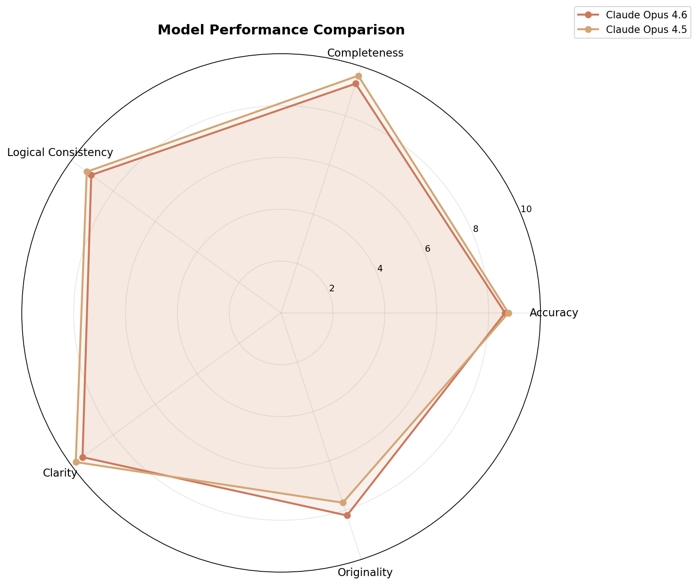
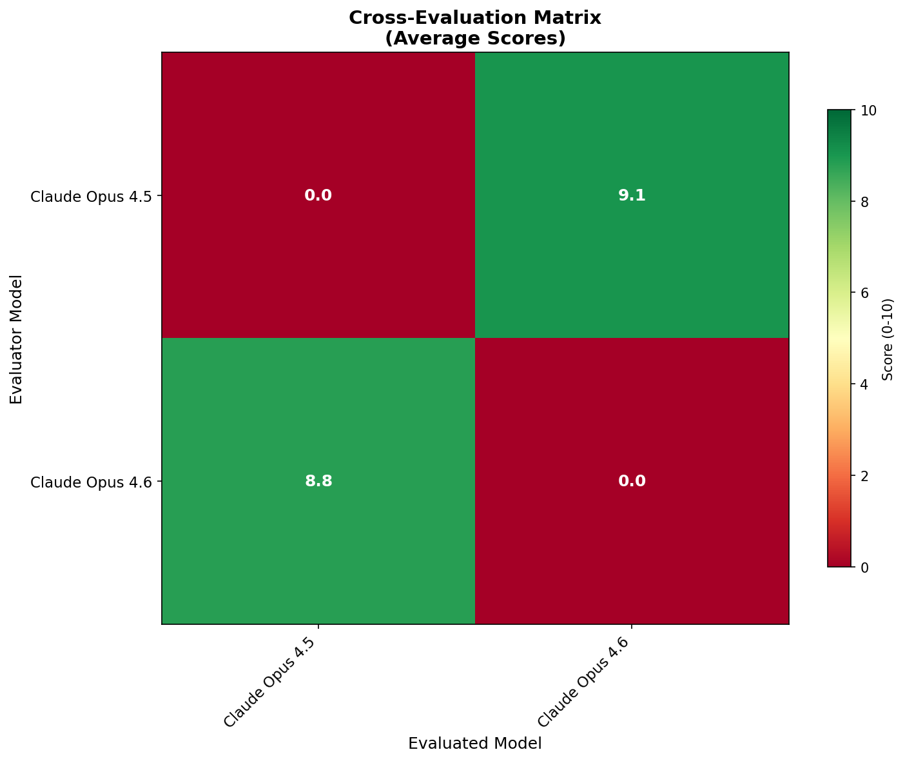
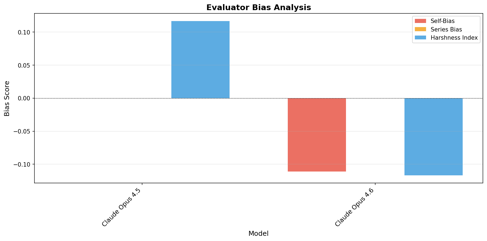
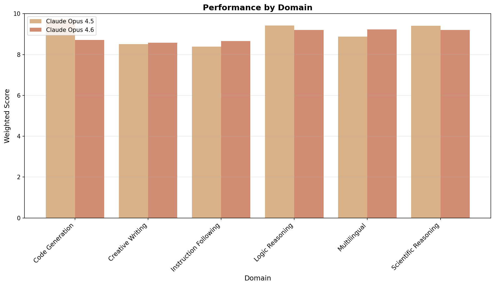
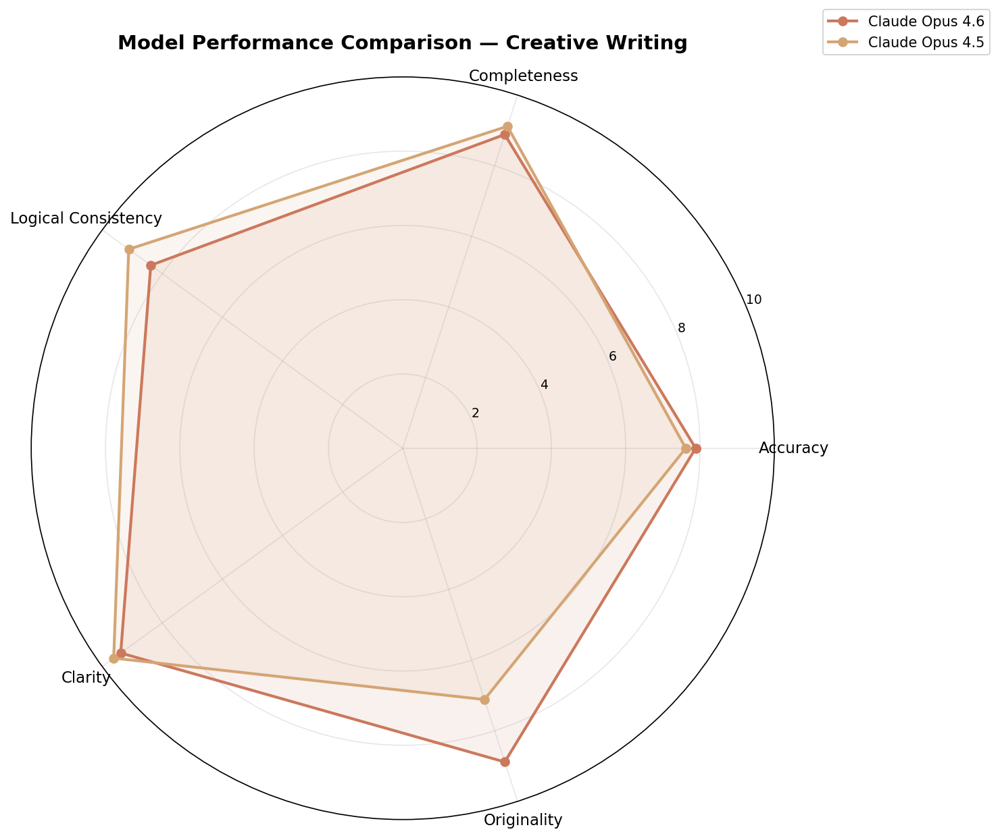
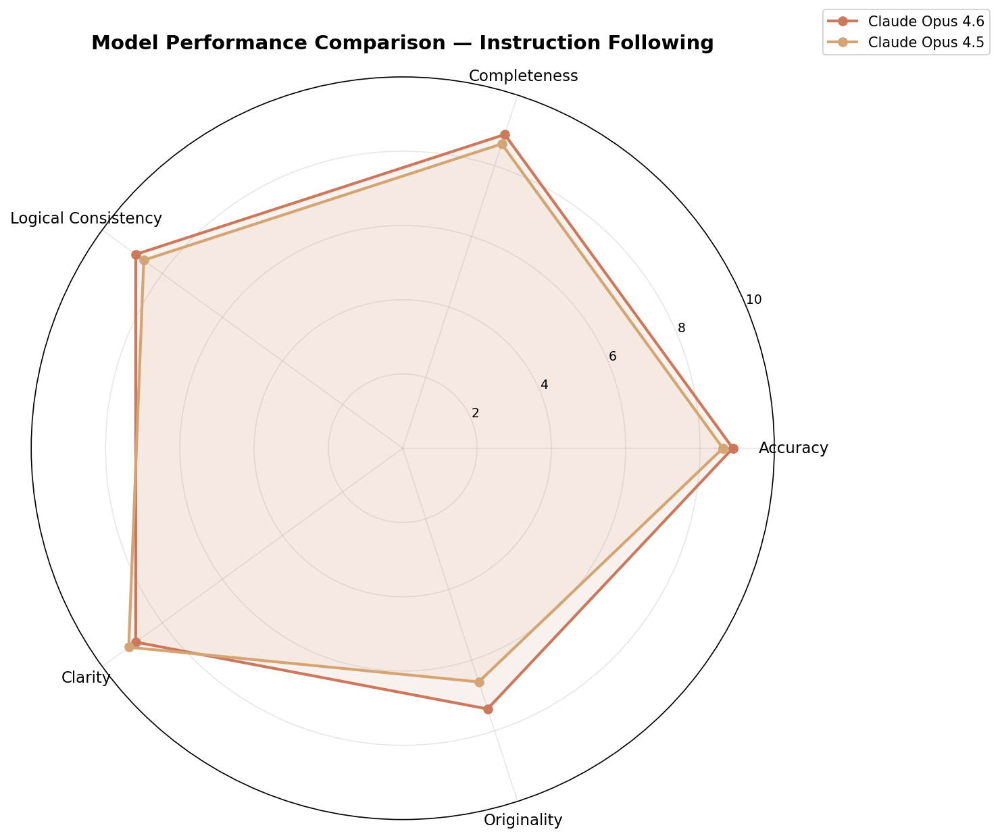
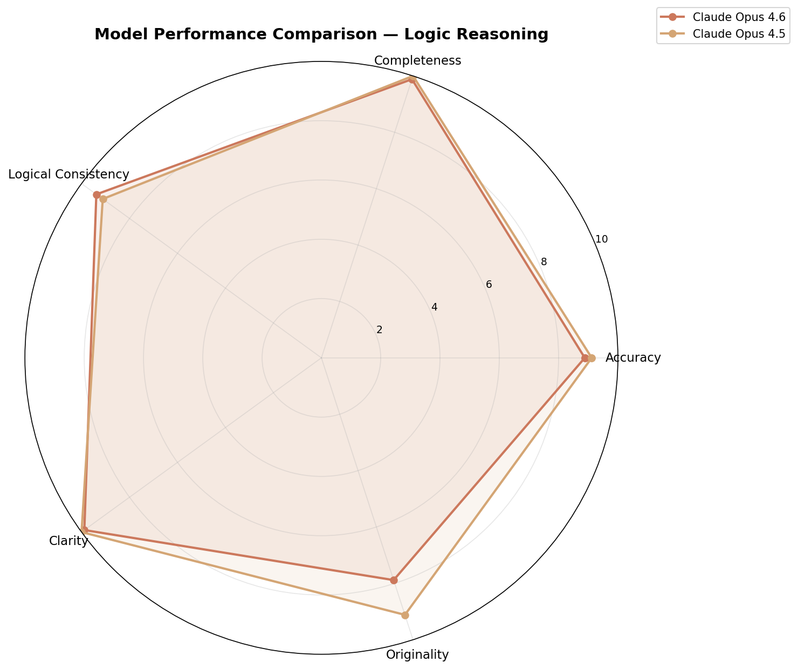
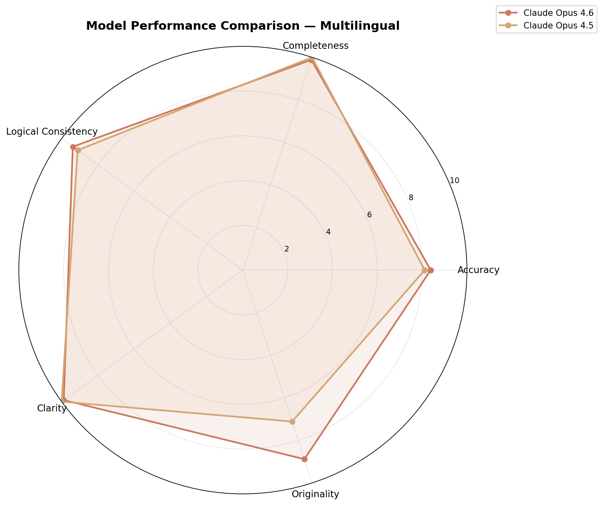
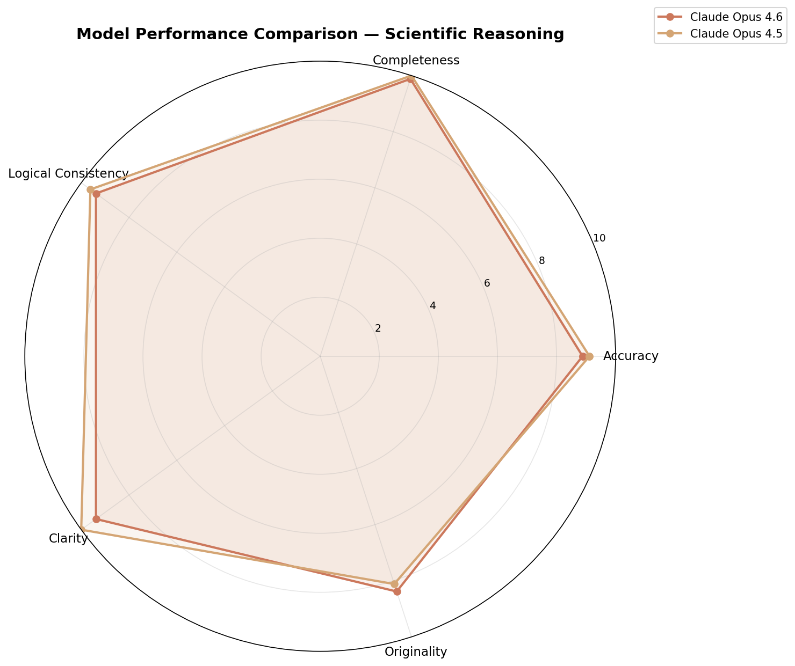

# LLM Cross-Evaluation Report

**Generated:** 2026-02-06 16:23
**System:** LLM Cross-Evaluation & Meta-Evaluation Framework

---

## Executive Summary

### Overall Rankings

| Rank | Model | Overall Score |
|------|-------|---------------|
| 1 | Claude Opus 4.5 | 9.05/10 |
| 2 | Claude Opus 4.6 | 8.93/10 |

### Key Findings

- Overall top performer: Claude Opus 4.5 (score: 9.1/10)
- Best at code_generation: Claude Opus 4.5 (score: 9.7/10)
- Best at multilingual: Claude Opus 4.6 (score: 9.2/10)
- Best at creative_writing: Claude Opus 4.6 (score: 8.6/10)
- Best at logic_reasoning: Claude Opus 4.5 (score: 9.4/10)

## Model Performance Profiles

### Claude Opus 4.5

**Overall Score:** 9.05/10
**Evaluator Reliability:** 7.8/10

#### Scores by Domain

| Domain | Accuracy | Completeness | Logical Consistency | Clarity | Originality | Weighted |
| --- | --- | --- | --- | --- | --- | --- |
| Code Generation | 10.0 | 10.0 | 10.0 | 10.0 | 8.1 | **9.7** |
| Creative Writing | 7.6 | 9.1 | 9.1 | 9.6 | 7.1 | **8.5** |
| Instruction Following | 8.6 | 8.6 | 8.6 | 9.1 | 6.6 | **8.4** |
| Logic Reasoning | 9.1 | 10.0 | 9.1 | 10.0 | 9.1 | **9.4** |
| Multilingual | 8.1 | 10.0 | 9.1 | 10.0 | 7.1 | **8.9** |
| Scientific Reasoning | 9.1 | 10.0 | 9.6 | 10.0 | 8.1 | **9.4** |

**Strengths:**
- Strong in code_generation (score: 9.7)
- Strong in logic_reasoning (score: 9.4)
- Excellent accuracy (8.8/10)
- Excellent completeness (9.6/10)
- Excellent logical_consistency (9.3/10)

**Bias Profile (as evaluator):**
- Self Bias: +0.00
- Series Bias: +0.00
- Harshness: +0.12
- Consistency: +0.51

---

### Claude Opus 4.6

**Overall Score:** 8.93/10
**Evaluator Reliability:** 8.5/10

#### Scores by Domain

| Domain | Accuracy | Completeness | Logical Consistency | Clarity | Originality | Weighted |
| --- | --- | --- | --- | --- | --- | --- |
| Code Generation | 8.9 | 8.4 | 8.9 | 9.4 | 7.9 | **8.7** |
| Creative Writing | 7.9 | 8.9 | 8.4 | 9.4 | 8.9 | **8.6** |
| Instruction Following | 8.9 | 8.9 | 8.9 | 8.9 | 7.4 | **8.7** |
| Logic Reasoning | 8.9 | 9.9 | 9.4 | 9.9 | 7.9 | **9.2** |
| Multilingual | 8.4 | 9.9 | 9.4 | 9.9 | 8.9 | **9.2** |
| Scientific Reasoning | 8.9 | 9.9 | 9.4 | 9.4 | 8.4 | **9.2** |

**Strengths:**
- Strong in multilingual (score: 9.2)
- Strong in logic_reasoning (score: 9.2)
- Excellent accuracy (8.6/10)
- Excellent completeness (9.3/10)
- Excellent logical_consistency (9.0/10)

**Bias Profile (as evaluator):**
- Self Bias: -0.11
- Series Bias: +0.00
- Harshness: -0.12
- Consistency: +0.78

---

## Domain Rankings

### Code Generation

🥇 **Claude Opus 4.5** — 9.7/10
🥈 **Claude Opus 4.6** — 8.7/10

### Creative Writing

🥇 **Claude Opus 4.6** — 8.6/10
🥈 **Claude Opus 4.5** — 8.5/10

### Instruction Following

🥇 **Claude Opus 4.6** — 8.7/10
🥈 **Claude Opus 4.5** — 8.4/10

### Logic Reasoning

🥇 **Claude Opus 4.5** — 9.4/10
🥈 **Claude Opus 4.6** — 9.2/10

### Multilingual

🥇 **Claude Opus 4.6** — 9.2/10
🥈 **Claude Opus 4.5** — 8.9/10

### Scientific Reasoning

🥇 **Claude Opus 4.5** — 9.4/10
🥈 **Claude Opus 4.6** — 9.2/10

## Bias Analysis

### Evaluator Bias Metrics

| Model | Self-Bias | Series Bias | Harshness | Consistency | Meta Reliability |
| --- | --- | --- | --- | --- | --- |
| opus_4_5 | +0.00 | +0.00 | +0.12 | 0.51 | 7.8 |
| opus_4_6 | -0.11 | +0.00 | -0.12 | 0.78 | 8.5 |

### Self-Bias Test Results

Total self-bias tests conducted: 3

## Disagreement Analysis

No significant disagreements detected.

## Key Insights

1. Overall top performer: Claude Opus 4.5 (score: 9.1/10)
2. Best at code_generation: Claude Opus 4.5 (score: 9.7/10)
3. Best at multilingual: Claude Opus 4.6 (score: 9.2/10)
4. Best at creative_writing: Claude Opus 4.6 (score: 8.6/10)
5. Best at logic_reasoning: Claude Opus 4.5 (score: 9.4/10)
6. Best at instruction_following: Claude Opus 4.6 (score: 8.7/10)
7. Best at scientific_reasoning: Claude Opus 4.5 (score: 9.4/10)
8. Most reliable evaluator: Claude Opus 4.6 (reliability: 8.5/10)

## Visualizations

### Radar Chart

### Evaluation Heatmap

### Bias Plot

### Domain Comparison

### Radar Code Generation

### Radar Creative Writing

### Radar Instruction Following

### Radar Logic Reasoning

### Radar Multilingual

### Radar Scientific Reasoning

## Cost Summary

**Total Cost:** $0.0000
**Total Tokens:** 0

## Methodology

### Evaluation Pipeline

1. **Task Execution (Layer 0):** Each model receives identical prompts
   across 6 domains: logic reasoning, code generation, creative writing,
   multilingual, scientific reasoning, and instruction following.

2. **Cross-Evaluation (Layer 1):** Each model evaluates all other models'
   responses using blind labels (Model A/B/C/D) to prevent identification
   bias. Evaluations are structured with 5 criteria scored 0-10.

3. **Meta-Evaluation (Layer 2):** Each model assesses the quality of
   other models' evaluations, checking for fairness, specificity,
   coverage, and calibration.

4. **Bias Detection:** Self-bias tests (20% injection rate), series
   bias analysis, and harshness calibration identify systematic
   evaluation tendencies.

5. **Performance Profiling:** Scores are bias-corrected and aggregated
   into domain profiles, with disagreement analysis highlighting
   areas where models' evaluation standards differ.

### Limitations

- Evaluation quality depends on models' ability to judge, which
  may correlate with their own capabilities.
- Self-bias detection uses statistical inference from limited samples.
- Some evaluation criteria may favor certain model architectures.
- Results should be interpreted as relative comparisons, not absolute
  performance measures.