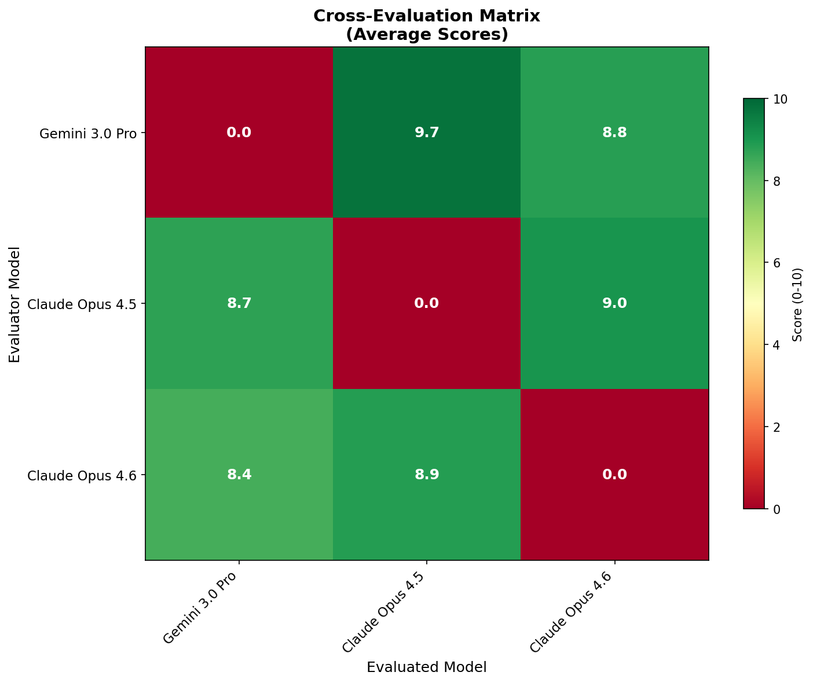
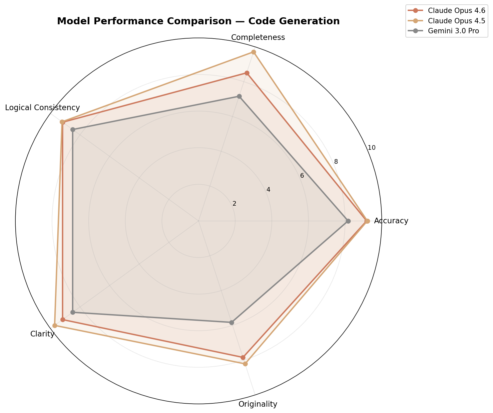
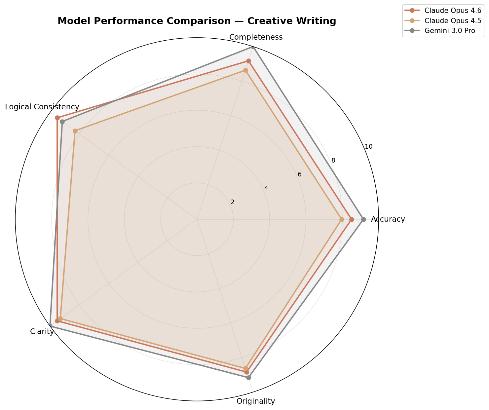
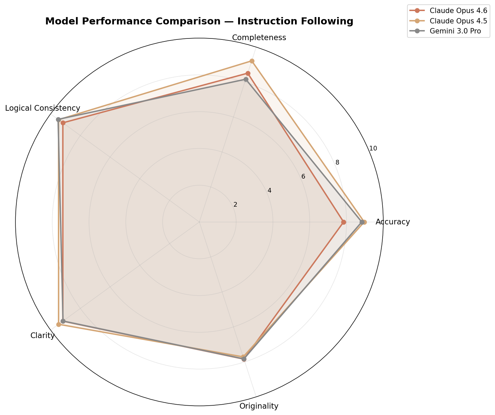
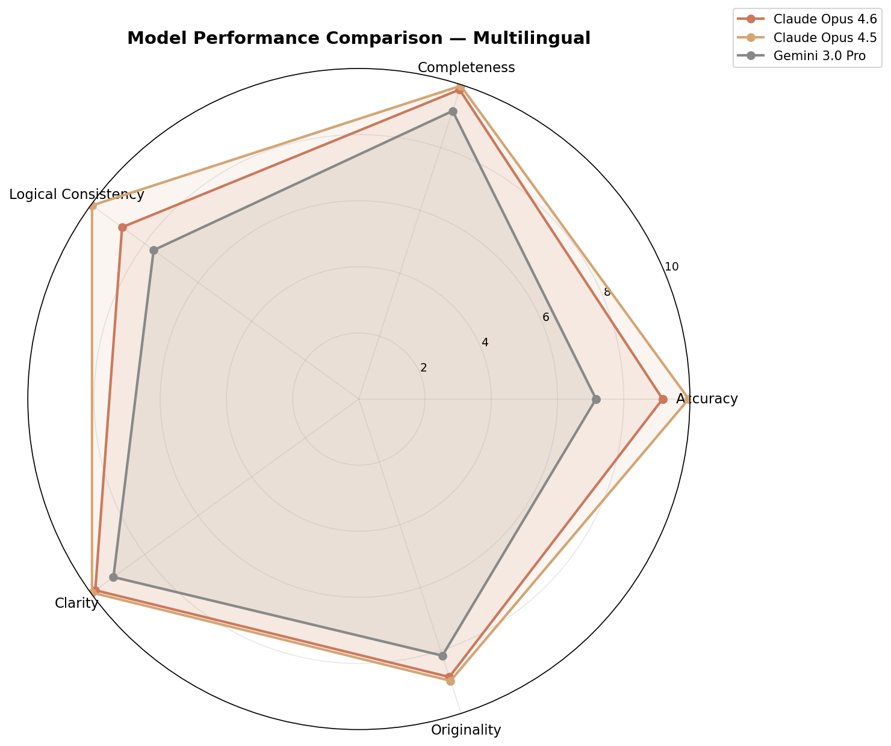
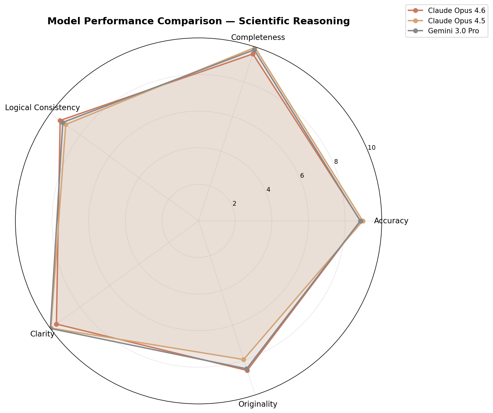

# LLM Cross-Evaluation Report

**Generated:** 2026-02-06 21:55
**System:** LLM Cross-Evaluation & Meta-Evaluation Framework

---

## Executive Summary

### Overall Rankings

| Rank | Model | Overall Score |
|------|-------|---------------|
| 1 | Claude Opus 4.5 | 9.19/10 |
| 2 | Claude Opus 4.6 | 9.03/10 |
| 3 | Gemini 3.0 Pro | 8.67/10 |

### Key Findings

- Overall top performer: Claude Opus 4.5 (score: 9.2/10)
- Best at multilingual: Claude Opus 4.5 (score: 9.8/10)
- Best at scientific_reasoning: Gemini 3.0 Pro (score: 9.2/10)
- Best at creative_writing: Gemini 3.0 Pro (score: 9.5/10)
- Best at code_generation: Claude Opus 4.5 (score: 9.2/10)

## Model Performance Profiles

### Claude Opus 4.5

**Overall Score:** 9.19/10
**Evaluator Reliability:** 8.3/10

#### Scores by Domain

| Domain | Accuracy | Completeness | Logical Consistency | Clarity | Originality | Weighted |
| --- | --- | --- | --- | --- | --- | --- |
| Code Generation | 9.2 | 9.7 | 9.2 | 9.7 | 8.2 | **9.2** |
| Creative Writing | 8.0 | 8.6 | 8.3 | 9.3 | 8.6 | **8.5** |
| Instruction Following | 9.0 | 9.2 | 9.5 | 9.5 | 7.7 | **9.0** |
| Logic Reasoning | 9.3 | 9.6 | 9.6 | 10.0 | 8.3 | **9.4** |
| Multilingual | 10.0 | 10.0 | 10.0 | 10.0 | 9.0 | **9.8** |
| Scientific Reasoning | 9.0 | 10.0 | 9.0 | 10.0 | 8.0 | **9.2** |

**Strengths:**
- Strong in multilingual (score: 9.8)
- Strong in logic_reasoning (score: 9.4)
- Excellent accuracy (9.1/10)
- Excellent completeness (9.5/10)
- Excellent logical_consistency (9.3/10)

**Bias Profile (as evaluator):**
- Self Bias: -0.25
- Series Bias: +0.31
- Harshness: -0.04
- Consistency: +0.59

---

### Claude Opus 4.6

**Overall Score:** 9.03/10
**Evaluator Reliability:** 8.5/10

#### Scores by Domain

| Domain | Accuracy | Completeness | Logical Consistency | Clarity | Originality | Weighted |
| --- | --- | --- | --- | --- | --- | --- |
| Code Generation | 9.2 | 8.5 | 9.2 | 9.2 | 7.8 | **8.8** |
| Creative Writing | 8.5 | 9.2 | 9.5 | 9.5 | 8.8 | **9.1** |
| Instruction Following | 7.8 | 8.5 | 9.2 | 9.2 | 7.8 | **8.5** |
| Logic Reasoning | 9.3 | 9.8 | 9.3 | 9.8 | 7.8 | **9.3** |
| Multilingual | 9.2 | 9.8 | 8.8 | 9.8 | 8.8 | **9.3** |
| Scientific Reasoning | 8.8 | 9.6 | 9.3 | 9.6 | 8.6 | **9.2** |

**Strengths:**
- Strong in logic_reasoning (score: 9.3)
- Strong in multilingual (score: 9.3)
- Excellent accuracy (8.8/10)
- Excellent completeness (9.2/10)
- Excellent logical_consistency (9.2/10)

**Bias Profile (as evaluator):**
- Self Bias: +0.66
- Series Bias: +0.47
- Harshness: -0.28
- Consistency: +1.32

---

### Gemini 3.0 Pro

**Overall Score:** 8.67/10
**Evaluator Reliability:** 5.4/10

#### Scores by Domain

| Domain | Accuracy | Completeness | Logical Consistency | Clarity | Originality | Weighted |
| --- | --- | --- | --- | --- | --- | --- |
| Code Generation | 8.2 | 7.2 | 8.5 | 8.5 | 5.8 | **7.7** |
| Creative Writing | 9.2 | 10.0 | 9.2 | 10.0 | 9.2 | **9.5** |
| Instruction Following | 8.8 | 8.2 | 9.5 | 9.2 | 7.8 | **8.8** |
| Logic Reasoning | 8.4 | 9.2 | 8.2 | 9.7 | 8.2 | **8.7** |
| Multilingual | 7.2 | 9.2 | 7.7 | 9.2 | 8.2 | **8.1** |
| Scientific Reasoning | 8.8 | 9.8 | 9.2 | 10.0 | 8.5 | **9.2** |

**Strengths:**
- Strong in creative_writing (score: 9.5)
- Strong in scientific_reasoning (score: 9.2)
- Excellent accuracy (8.4/10)
- Excellent completeness (8.9/10)
- Excellent logical_consistency (8.7/10)

**Bias Profile (as evaluator):**
- Self Bias: -0.77
- Series Bias: +0.00
- Harshness: +0.36
- Consistency: +1.47

---

## Domain Rankings

### Code Generation

🥇 **Claude Opus 4.5** — 9.2/10
🥈 **Claude Opus 4.6** — 8.8/10
🥉 **Gemini 3.0 Pro** — 7.7/10

### Creative Writing

🥇 **Gemini 3.0 Pro** — 9.5/10
🥈 **Claude Opus 4.6** — 9.1/10
🥉 **Claude Opus 4.5** — 8.5/10

### Instruction Following

🥇 **Claude Opus 4.5** — 9.0/10
🥈 **Gemini 3.0 Pro** — 8.8/10
🥉 **Claude Opus 4.6** — 8.5/10

### Logic Reasoning

🥇 **Claude Opus 4.5** — 9.4/10
🥈 **Claude Opus 4.6** — 9.3/10
🥉 **Gemini 3.0 Pro** — 8.7/10

### Multilingual

🥇 **Claude Opus 4.5** — 9.8/10
🥈 **Claude Opus 4.6** — 9.3/10
🥉 **Gemini 3.0 Pro** — 8.1/10

### Scientific Reasoning

🥇 **Gemini 3.0 Pro** — 9.2/10
🥈 **Claude Opus 4.6** — 9.2/10
🥉 **Claude Opus 4.5** — 9.2/10

## Bias Analysis

### Evaluator Bias Metrics

| Model | Self-Bias | Series Bias | Harshness | Consistency | Meta Reliability |
| --- | --- | --- | --- | --- | --- |
| gemini_3_pro | -0.77 | +0.00 | +0.36 | 1.47 | 5.4 |
| opus_4_5 | -0.25 | +0.31 | -0.04 | 0.59 | 8.3 |
| opus_4_6 | +0.66 | +0.47 | -0.28 | 1.32 | 8.5 |

### Self-Bias Test Results

Total self-bias tests conducted: 15

### Flagged Evaluations

Evaluations that deviated significantly from consensus:

- **opus_4_5** rated **opus_4_6** on code_generation_002: 8.4 vs consensus 5.6 (deviation: 2.8, lenient)
- **gemini_3_pro** rated **opus_4_6** on code_generation_002: 2.8 vs consensus 5.6 (deviation: 2.8, harsh)
- **opus_4_6** rated **gemini_3_pro** on code_generation_002: 3.6 vs consensus 5.7 (deviation: 2.1, harsh)
- **opus_4_5** rated **gemini_3_pro** on code_generation_002: 7.8 vs consensus 5.7 (deviation: 2.1, lenient)

## Disagreement Analysis

No significant disagreements detected.

## Key Insights

1. Overall top performer: Claude Opus 4.5 (score: 9.2/10)
2. Best at multilingual: Claude Opus 4.5 (score: 9.8/10)
3. Best at scientific_reasoning: Gemini 3.0 Pro (score: 9.2/10)
4. Best at creative_writing: Gemini 3.0 Pro (score: 9.5/10)
5. Best at code_generation: Claude Opus 4.5 (score: 9.2/10)
6. Best at logic_reasoning: Claude Opus 4.5 (score: 9.4/10)
7. Best at instruction_following: Claude Opus 4.5 (score: 9.0/10)
8. Most reliable evaluator: Claude Opus 4.6 (reliability: 8.5/10)

## Visualizations

### Radar Chart

### Evaluation Heatmap

### Bias Plot

### Domain Comparison

### Radar Code Generation

### Radar Creative Writing

### Radar Instruction Following

### Radar Logic Reasoning

### Radar Multilingual

### Radar Scientific Reasoning

## Cost Summary

**Total Cost:** $0.0000
**Total Tokens:** 0

## Methodology

### Evaluation Pipeline

1. **Task Execution (Layer 0):** Each model receives identical prompts
   across 6 domains: logic reasoning, code generation, creative writing,
   multilingual, scientific reasoning, and instruction following.

2. **Cross-Evaluation (Layer 1):** Each model evaluates all other models'
   responses using blind labels (Model A/B/C/D) to prevent identification
   bias. Evaluations are structured with 5 criteria scored 0-10.

3. **Meta-Evaluation (Layer 2):** Each model assesses the quality of
   other models' evaluations, checking for fairness, specificity,
   coverage, and calibration.

4. **Bias Detection:** Self-bias tests (20% injection rate), series
   bias analysis, and harshness calibration identify systematic
   evaluation tendencies.

5. **Performance Profiling:** Scores are bias-corrected and aggregated
   into domain profiles, with disagreement analysis highlighting
   areas where models' evaluation standards differ.

### Limitations

- Evaluation quality depends on models' ability to judge, which
  may correlate with their own capabilities.
- Self-bias detection uses statistical inference from limited samples.
- Some evaluation criteria may favor certain model architectures.
- Results should be interpreted as relative comparisons, not absolute
  performance measures.